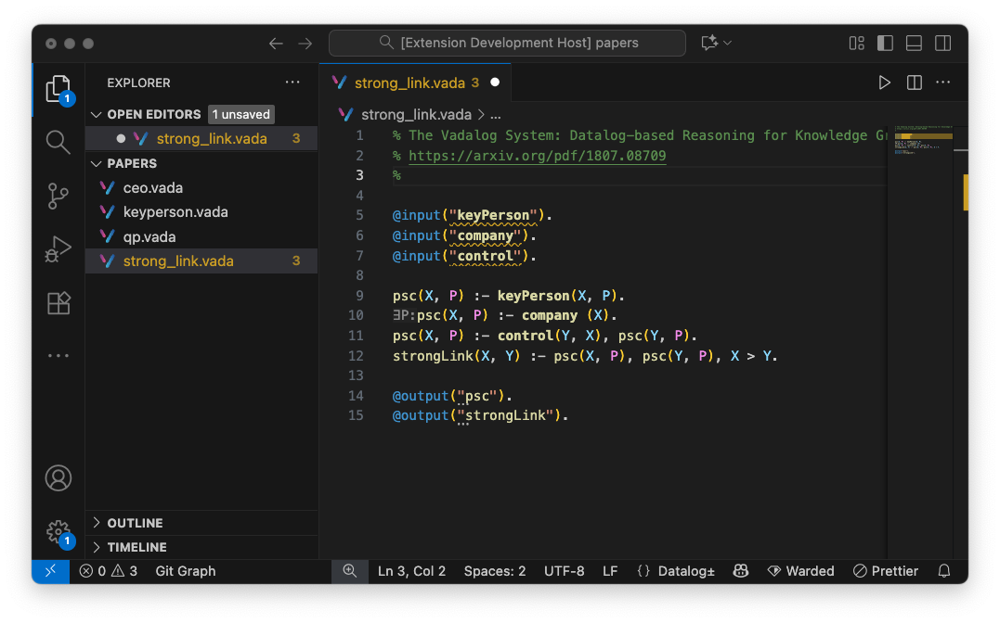

<table align="center"><tr><td align="center" width="9999">

<strong>Vadacode</strong> is a <a target="_blank" href="https://code.visualstudio.com/">Visual Studio Code</a> extension to support development in Datalog± language.
</td></tr></table>

## Quick start

1. Install `vadacode` from the latest `.vsix` file in the releases channel;
2. Open or create a `.vada` files and start coding!

## Features

Vadacode is an Integrated Development Environment to support writing Datalog± logic programs into a Datalog± dialect called Vadalog, which is documented [here](https://www.vadalog.org). At the Bank of Italy, we use Vadacode to write and test logic programs using the [Vadalog engine](https://en.wikipedia.org/wiki/Vadalog).

Discover everything Vadacode can do at https://www.vadalog.org/vadacode-manual/latest. 

Vadacode has been presented at [VLDB 2025](https://vldb.org/2025/), along with the [demo paper](https://www.vldb.org/pvldb/vol18/p5411-gentili.pdf) _Vadacode: A Logician-Friendly IDE for Datalog_, Proceedings of the VLDB Endowment 18(12):5411-5414, September 2025.

## License

Vadacode is free and the source is available under the [Server Side Public License (SSPL) v1](LICENSE.txt).
See individual files for details which will specify the license applicable to each file. Files subject to the SSPL will be noted in their headers.